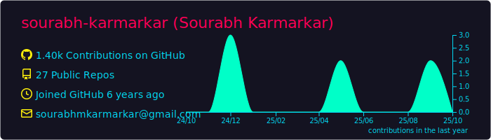
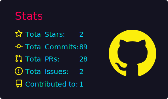
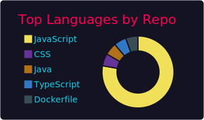

# Hi there 👋, I'm Sourabh Karmarkar!

I'm a Full Stack Developer with a passion for building clean, efficient and user-friendly web applications. I love building utilities and software aimed at increasing developer productivity. I have experience working with a variety of technologies including **React**, **Node.js**, **Express.js**, **MongoDB**, **MySQL** and **AWS**.

## 🌱 I’m currently learning...

**Serverless** and **AWS** to improve my skills and stay up-to-date with the latest trends.

## 📫 How to reach me:

You can find me on [LinkedIn](https://www.linkedin.com/in/sourabh-karmarkar/) or [Twitter](https://twitter.com/sourabh_kmk).

## 💬 Ask me about:

- Full Stack Web Development
- React
- Node.js
- Express.js
- MongoDB
- AWS
- Git

## ⚡ Fun fact:

When I'm not coding, you can find me playing badminton or binge-watching my favorite TV shows.

  

  

    
    
  

  

